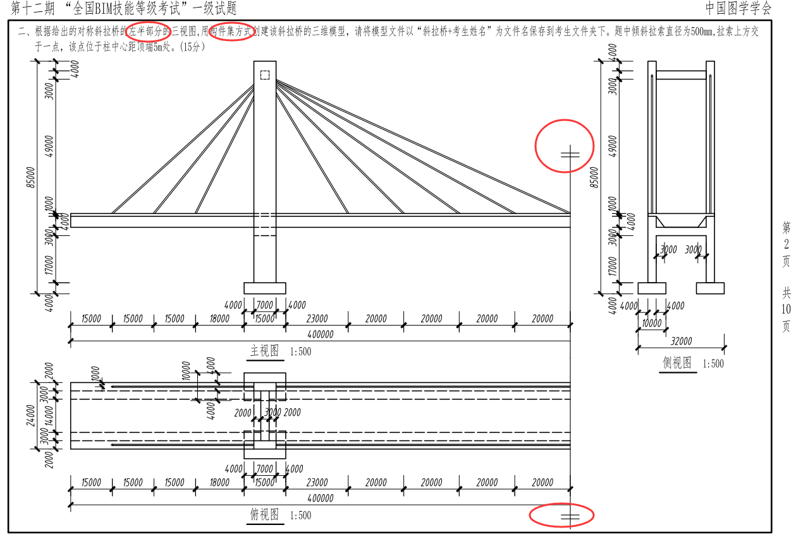
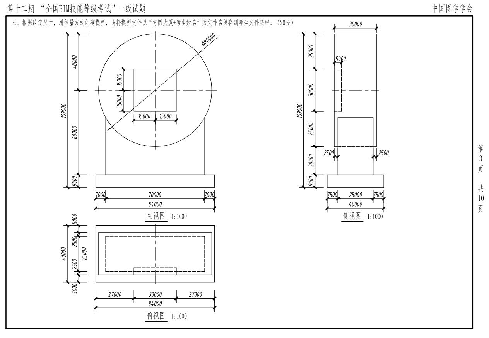
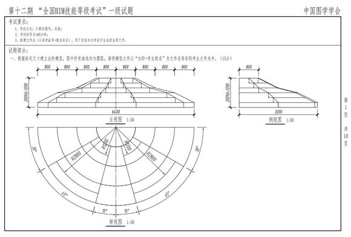
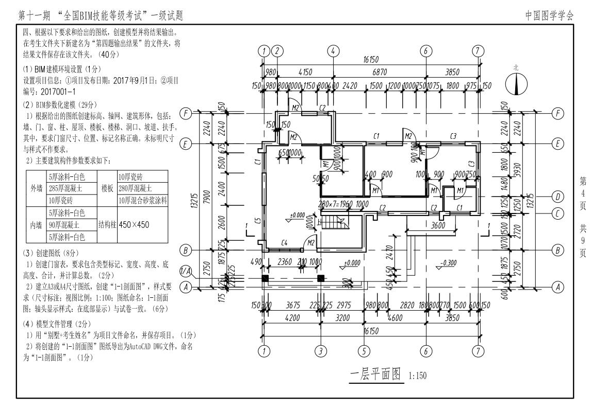

## 让结局不留遗憾

本考试没有很难，只需有清晰的思路，将自己所学展现，过关不是问题

### 考试题型汇总

本考试总共分为四个部分，前三个部分为小题，共计50分，最后一道题为大题，分值为50分，需要更多时间，但是并不难。

类型题分析 

<em>--构件集（必考题）--</em> 
 
<em>--体量（必考题）--</em> 
 
<em>--异型构件（近两年高几率考试题）--</em> 
 
<em>--大题（必考题）--</em> 
 

- Bulleted
- List

1. Numbered
2. List

**Bold** and _Italic_ and `Code` text

[Link](url) and 

For more details see [GitHub Flavored Markdown](https://guides.github.com/features/mastering-markdown/).

### Jekyll Themes

Your Pages site will use the layout and styles from the Jekyll theme you have selected in your [repository settings](https://github.com/YanQimeng/BIM/settings). The name of this theme is saved in the Jekyll `_config.yml` configuration file.

### Support or Contact

Having trouble with Pages? Check out our [documentation](https://help.github.com/categories/github-pages-basics/) or [contact support](https://github.com/contact) and we’ll help you sort it out.
