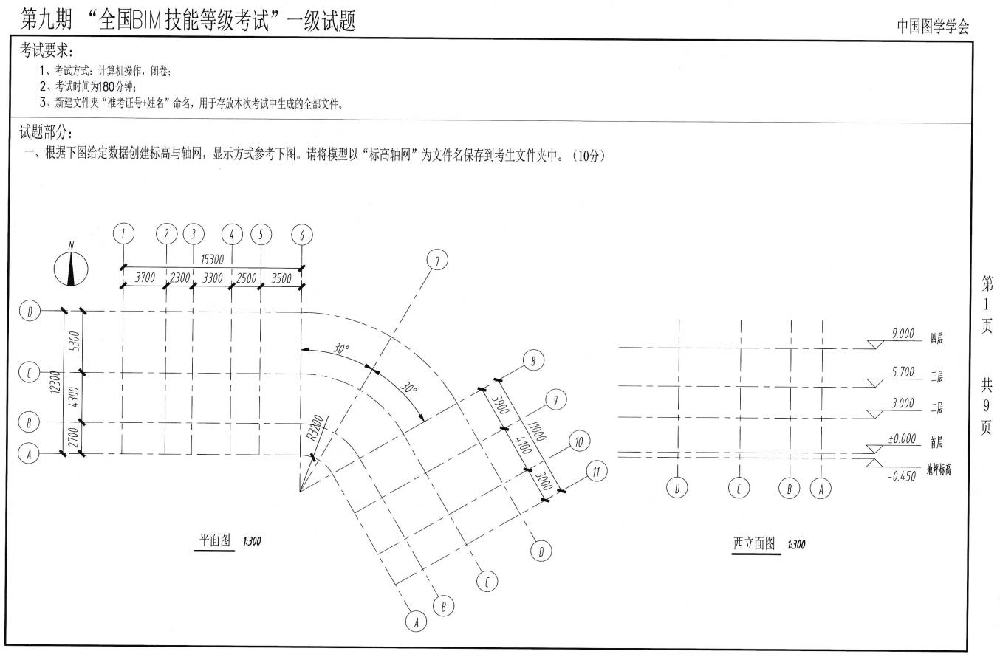

## BIM全国技能等级考试

只需有清晰的思路，考试通过很简单

### 考试题型汇总

本考试总共分为四个部分，前三个部分为小题，共计<mark>50分</mark>，最后一道题为大题，分值为<mark>50分</mark>，需要更多时间，但是并不难。

类型题分析 

<em>--构件集（必考题）--</em> 
 
<em>--体量（必考题）--</em> 
 
<em>--异型构件（近两年高几率考试题）--</em> 
 
<em>--大题（必考题）--</em> 
 
<em>--楼梯题（难点题）--</em> 
 
<em>--标高轴网题（需掌握题）--</em> 
 
<em>--屋顶题（需掌握题）--</em> 
 

<h2 align="center" >类型题详细分析</h2>
<h4>构件集（必考题）</h4>  	

	<b>第一步</b>，读题，思考三维形状  
			<mark>根据图纸的两个视图，想象构件的三维形状</mark>  
	<b>第二步</b>，思考可以分为几个部分制作 
			  
			<mark>以十三期构件集题为例，结合题意，此为类似于纪念碑的构件，可以将构件分为台阶（1），底座（2），碑底座（3），纪念碑体（4），纪念碑顶（5）五个部分</mark>  
	<b>第三步</b>，每一个部分可以用什么命令做出来（拉伸，旋转，放样，融合或者两种命令组合使用） 
			 
			<mark>台阶使用拉伸命令，在立面中将台阶形状做出来，拉伸相应长度,四个方向的台阶可以先做完一个，其他的通过旋转镜像来获得</mark>  
			 
			<mark>底座使用拉伸命令，在平面面中将平底座状做出来，拉伸相应高度即可</mark>  
			 
			<mark>碑底座使用拉伸命令，在平面中将碑底座形状做出来，拉伸相应高度即可</mark>  
			 
			<mark>纪念碑体使用融合命令，在平面中将底面矩形和顶面矩形做出来，拉伸相应高度即可</mark>  
			  
			<mark>纪念碑顶使用放样命令，在平面中将碑顶的外轮廓画出来，再在立面中绘制直角三角形，完成放样即可</mark>  
	<b>第四步</b>，以上都是在绘制前在脑海中想象的过程，在以上都想通了以后开始绘制 
	<b>第五步</b>，绘制完成以后再认真对照一遍题目要求，在三维视图保存即可 

<h4>体量（必考题）</h4>  

	<b>第一步</b>，读题，确认是否需要载入到项目中 
	<mark>读题，看题目中是否出现需要布置楼板，屋顶，幕墙，墙等构件，如果有，需要将族载入项目文件中再进行添加楼板，屋顶，幕墙等操作；没有可以直接在族中保存</mark>  
	<b>第二步</b>，思考一下，如何做可以生成形状，可以将实体性状分为几个部分好做 
	  
	<mark>以十三期体量题为例，我们可以将这个拱桥分为桥面（1），拱形梁（2），悬索（3），梁（4）四个部分</mark> 
	<b>第三步</b>，开始建立体量模型 
	  
	<mark>桥面可以在立面中将桥面的轮廓绘制出来，选中轮廓点击生成实体形状，最后将桥面拉伸到相应的长度即可</mark>  
	  
	<mark>拱形梁可以在立面中将拱形梁的轮廓绘制出来，选中轮廓点击生成实体形状，在三维中将拱形梁拉伸为图纸厚度，最后将另一根拱形梁复制出来即可</mark>  
	  
	<mark>悬索可以在平面中将悬索的轮廓绘制出来，选中轮廓点击生成实体形状，在三维中将悬索拉伸为图纸中的高度，最后将其他悬索复制出来，调整高度即可</mark>  
	<b>第四步</b>，最后保存为项目还是族（项目后缀.rvt--族后缀.rfa） 
	<mark>如果题目中有相关楼板，屋顶，墙体等要求时，载入到项目中，在需要楼板的标高，建立标高，点中体量点击体量楼层，需要的标高打钩；点击幕墙系统，点击需要的面，点创建系统；点击屋顶，确认是否为玻璃斜窗还是普通屋顶，点击面后点击创建屋顶；没有此类要求的直接保存为族文件</mark> 
	<b>第五步</b>，在三维窗口点击保存 
	<mark>再三维中保存是为了，在电脑中的缩略图中看到的是我们三维的形状。 PS：此步骤仅为了好看~</mark> 

 [阿尔山项目漫游视频](https://v.youku.com/v_show/id_XNDA3MjYxNDQ2MA==.html?spm=a2hzp.8244740.0.0).

